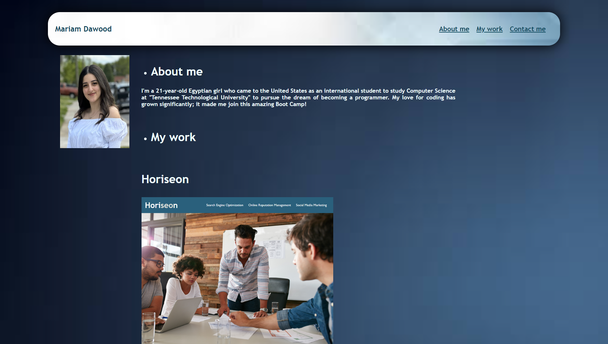

# Project title: My Portfolio

## Description

- My motivation on doing this project was to showcase my skills to the professional industry

- I builded that project for my career

- I made everything linkable. For the header I made the "About me, My Work and Contact me" to navigate to each section when clicking on it, for the projects in "My Work" section when clicking on each project it's going to navigate you to its deployed site, and lastly I attached my GitHub link at the "Contact me" and linked it to GitHub page.

- I learned to build a code from the scratch 

## Installation

Download the files from the repository and install

# Usage

Link to view: [My Portfolio](https://mariamdawood.github.io/My-Portfolio/)

Screenshot of website:

## Credits

- I reached assistance from AskBCS

- I reached assistance from my instructor

- I reached assistance from my TA